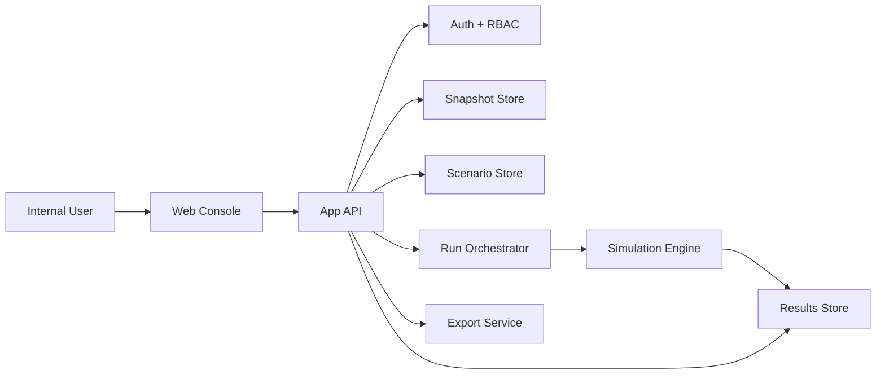

# Build Spec v1: BGC Alpha Simulator

Status: Draft v1  
Date: 2026-03-16  
Depends on: `bgc-alpha-simulator-prd-founder-v1.md`, `bgc-alpha-simulator-prd.md`

## 1. Purpose

This document translates the approved product direction into a build-ready specification.

It defines:

- the system shape,
- the internal web app structure,
- the screen set,
- core user flows,
- data model entities,
- simulation engine inputs and outputs,
- MVP implementation boundaries.

This is still a product and systems spec, not a sprint ticket list.

## 2. Product Statement

The BGC Alpha Simulator is an internal web-based decision console backed by a deterministic simulation engine.

Its job is to:

- ingest validated historical BGC and iBLOOMING data,
- encode the current reward system as the baseline,
- let approved users test ALPHA policy scenarios,
- compare outcomes across scenarios,
- output a decision-ready ALPHA pilot recommendation.

## 3. Build Principles

- `Decision-first`
  Every screen and output should help users choose or reject policy options.
- `Deterministic`
  Same snapshot + same model version + same parameters must produce the same run result.
- `Traceable`
  Every recommendation must be tied back to a dataset snapshot, model version, and scenario parameter set.
- `Internal-only`
  The app is for founder, operator, and internal team use only.
- `Baseline-preserving`
  The current BGC and iBLOOMING reward logic is the starting point and must be versioned explicitly.

## 4. System Overview

The system has 4 major parts:

### 4.1 Frontend: Internal Web Console

Used to:

- select data snapshots,
- configure scenarios,
- run simulations,
- review outputs,
- export decision packs.

### 4.2 Backend: Application API

Used to:

- manage auth and roles,
- manage snapshots and validation state,
- persist scenarios and runs,
- orchestrate simulation jobs,
- serve metrics and exports.

### 4.3 Simulation Engine

Used to:

- load a snapshot and baseline model,
- apply scenario parameters,
- simulate ALPHA distribution and policy outcomes,
- generate run outputs and recommendation signals.

### 4.4 Data and Results Store

Used to persist:

- dataset snapshots,
- validation results,
- baseline model versions,
- scenarios,
- simulation runs,
- output metrics,
- exports,
- audit events.

## 5. High-Level Architecture



## 6. Recommended App Sections

The MVP information architecture should include:

- `/overview`
- `/snapshots`
- `/scenarios`
- `/runs/:runId`
- `/compare`
- `/distribution/:runId`
- `/treasury/:runId`
- `/decision-pack/:runId`
- `/settings` if needed for admin-only model and role management

## 7. User Roles

### 7.1 Founder

Can:

- view all snapshots,
- view all scenarios and runs,
- compare runs,
- export decision packs,
- mark a run as preferred or shortlisted.

### 7.2 Analyst / Operator

Can:

- upload or register snapshots,
- create scenarios,
- execute runs,
- compare results,
- create draft exports.

### 7.3 Product / Tokenomics Lead

Can:

- manage scenario parameters,
- manage baseline model notes,
- interpret outputs,
- create recommendation drafts.

### 7.4 Engineering Lead

Can:

- view outputs,
- inspect implementation-facing config exports,
- review baseline model versions.

### 7.5 Admin

Can:

- manage roles,
- manage model versions,
- manage snapshot lifecycle,
- view audit history.

## 8. Core Screen Specs

## 8.1 Overview

### Purpose

Give a fast view of current state:

- latest snapshot in use,
- latest runs,
- flagged risks,
- recent recommendation candidates.

### Main Components

- active snapshot card
- latest run list
- highlighted alerts
- quick action buttons:
  - `New Scenario`
  - `Run Baseline`
  - `Compare Recent Runs`

### States

- no snapshot yet
- snapshot ready, no runs yet
- runs available
- active issues present

## 8.2 Data Snapshot

### Purpose

Manage the dataset snapshot used for simulation.

### Main Components

- snapshot list
- snapshot detail panel
- validation summary
- schema coverage summary
- data quality issues table

### User Actions

- upload or register snapshot
- trigger validation
- mark snapshot as approved for simulation
- archive old snapshot

### Required Fields per Snapshot

- snapshot id
- source system(s)
- date range
- import timestamp
- validation status
- approved by
- notes

### States

- draft
- validating
- invalid
- valid
- approved
- archived

## 8.3 Scenario Builder

### Purpose

Create, edit, and save policy scenarios.

### Main Components

- scenario metadata
- template selector
- parameter form grouped by category
- assumption notes
- save and run actions

### Parameter Groups

- conversion
- reward intensity
- caps
- sink usage
- treasury thresholds
- cash-out rules
- anti-abuse rules
- operational / gas assumptions
- scenario shocks

### Minimum Editable Parameters

- `k_pc`
- `k_sp`
- `reward_global_factor`
- `reward_pool_factor`
- `cap_user_monthly`
- `cap_group_monthly`
- `sink_target`
- `treasury_runway_min_months`
- `payout_inflow_max_ratio`
- `cashout_mode`
- `cashout_min_usd`
- `cashout_fee_bps`
- `cashout_windows_per_year`
- `cashout_window_days`
- `cashout_processing_lag_days`
- `cashout_cooloff_days`
- `sponsor_gas_user_daily_usd`
- `sponsor_gas_global_daily_usd`
- `referral_cooldown_days`
- `max_tier1_joins_per_actor_per_day`
- `duplicate_device_limit`
- `audit_sample_rate_pct`
- `penalty_cooloff_days`

### Preset Templates

- `Baseline`
- `Conservative`
- `Growth`
- `Stress`

### States

- new unsaved scenario
- saved draft
- locked-for-run snapshot mismatch warning
- ready to run

## 8.4 Run Results

### Purpose

Show the output of one simulation run.

### Main Components

- run header
- snapshot and model metadata
- summary metrics cards
- charts
- recommendation summary
- flagged risks

### Required Summary Metrics

- total ALPHA issued
- total ALPHA spent
- total ALPHA held
- total ALPHA cash-out equivalent
- sink utilization rate
- payout-to-inflow ratio
- reserve runway estimate
- top cohort reward share
- flagged abuse count

### Run Metadata

- run id
- scenario name
- author
- created at
- snapshot used
- model version used
- run status

### States

- queued
- running
- completed
- failed

## 8.5 Compare Runs

### Purpose

Compare multiple runs side by side.

### Main Components

- selected-run manager
- radar quick-scan
- compare decision snapshot
- business cashflow comparison
- ALPHA policy comparison
- treasury risk comparison
- distribution, strategic-goal, milestone, and audit sections

### Comparison Dimensions

- issuance
- spend vs hold behavior
- sink utilization
- payout pressure
- runway
- fairness
- segment impact
- operational cost exposure
- policy risk flags

### States

- fewer than 2 runs selected
- 2-5 runs selected
- comparison export ready

## 8.6 Distribution

### Purpose

Show where ALPHA goes across segments and reward sources.

### Main Components

- distribution by user segment
- distribution by affiliate tier
- distribution by reward source
- hold vs spend vs cash-out split
- top cohort concentration analysis

### Views

- segment breakdown
- reward source breakdown
- cohort concentration
- segment-level trend over time

## 8.7 Treasury and Risk

### Purpose

Show sustainability and system safety outcomes.

### Main Components

- inflow vs outflow chart
- reserve ratio chart
- payout pressure chart
- shock resilience summary
- threshold breach log

### Required Risk Signals

- runway below threshold
- payout/inflow above threshold
- cash-out pressure spike
- cap-hit rate too high
- suspicious abuse or concentration indicators

## 8.8 Decision Pack

### Purpose

Create a founder-ready summary from one run or a comparison set.

### Main Components

- recommendation status
- evaluated scenario basis
- blockers or rejection reasons
- unresolved questions
- strategic-goal evidence
- milestone gates
- export actions

### Required Sections

- scenario context
- key recommendation
- why this scenario is currently defensible
- what risks or blockers remain
- what founders still need to decide

## 9. Core User Flows

## 9.1 Snapshot Approval Flow

1. Analyst uploads or registers snapshot.
2. System validates schema and coverage.
3. Analyst reviews validation issues.
4. Admin or approved role marks snapshot as approved.
5. Snapshot becomes selectable in Scenario Builder.

## 9.2 Scenario Creation Flow

1. User opens Scenario Builder.
2. User chooses template.
3. User modifies parameters.
4. User saves scenario.
5. User optionally runs immediately.

## 9.3 Run Execution Flow

1. User chooses scenario and snapshot.
2. System checks compatibility.
3. Run job is queued.
4. Engine executes.
5. Results are stored.
6. User opens Run Results page.

## 9.4 Comparison Flow

1. User selects 2 or more completed runs.
2. System builds comparison summary.
3. User reviews deltas.
4. User exports compare-based decision pack if needed.

## 9.5 Recommendation Export Flow

1. User opens Decision Pack page.
2. User confirms recommendation framing.
3. System generates export.
4. Export is stored and downloadable.

## 10. Data Model

The following entities are required for MVP.

## 10.1 users

Purpose:

- internal app users

Fields:

- `id`
- `name`
- `email`
- `role`
- `status`
- `created_at`
- `updated_at`

## 10.2 dataset_snapshots

Purpose:

- immutable historical simulation datasets

Fields:

- `id`
- `name`
- `source_systems`
- `date_from`
- `date_to`
- `file_uri` or `storage_key`
- `record_count`
- `validation_status`
- `approved_by`
- `approved_at`
- `notes`
- `created_by`
- `created_at`

## 10.3 snapshot_validation_issues

Purpose:

- store validation problems and warnings

Fields:

- `id`
- `snapshot_id`
- `severity`
- `issue_type`
- `message`
- `row_ref`
- `created_at`

## 10.4 baseline_model_versions

Purpose:

- version the encoded BGC and iBLOOMING baseline logic

Fields:

- `id`
- `version_name`
- `description`
- `status`
- `ruleset_json`
- `created_by`
- `created_at`

## 10.5 scenarios

Purpose:

- reusable scenario definitions

Fields:

- `id`
- `name`
- `template_type`
- `description`
- `snapshot_id_default` nullable
- `model_version_id`
- `parameter_json`
- `created_by`
- `created_at`
- `updated_at`

## 10.6 simulation_runs

Purpose:

- record execution attempts and completed runs

Fields:

- `id`
- `scenario_id`
- `snapshot_id`
- `model_version_id`
- `status`
- `started_at`
- `completed_at`
- `created_by`
- `engine_version`
- `seed_hash` or deterministic signature
- `run_notes`

## 10.7 run_summary_metrics

Purpose:

- top-level numeric results for one run

Fields:

- `id`
- `run_id`
- `metric_key`
- `metric_value`
- `metric_unit`

## 10.8 run_time_series

Purpose:

- chartable time-series outcomes

Fields:

- `id`
- `run_id`
- `period_key`
- `metric_key`
- `metric_value`

## 10.9 run_segment_metrics

Purpose:

- segment and cohort results

Fields:

- `id`
- `run_id`
- `segment_type`
- `segment_key`
- `metric_key`
- `metric_value`

## 10.10 run_flags

Purpose:

- store warnings and breaches

Fields:

- `id`
- `run_id`
- `flag_type`
- `severity`
- `message`
- `period_key` nullable

## 10.11 decision_packs

Purpose:

- founder-ready recommendation outputs

Fields:

- `id`
- `run_id` nullable
- `compare_signature` nullable
- `title`
- `recommendation_json`
- `export_status`
- `created_by`
- `created_at`

## 10.12 audit_events

Purpose:

- track important system actions

Fields:

- `id`
- `actor_user_id`
- `entity_type`
- `entity_id`
- `action`
- `metadata_json`
- `created_at`

## 11. Data Relationships

- one `dataset_snapshot` has many `snapshot_validation_issues`
- one `baseline_model_version` has many `scenarios`
- one `scenario` has many `simulation_runs`
- one `simulation_run` has many:
  - `run_summary_metrics`
  - `run_time_series`
  - `run_segment_metrics`
  - `run_flags`
- one `simulation_run` can have zero or more `decision_packs`

## 12. Simulation Engine Contract

## 12.1 Engine Inputs

The engine must accept:

- `snapshot_id`
- `baseline_model_version_id`
- `scenario_parameters`
- `scenario_template_type`
- `shock_config`
- `output_granularity`

### Input Schema Outline

```json
{
  "snapshot_id": "snap_2025q4_v1",
  "baseline_model_version_id": "model_v1",
  "scenario": {
    "name": "Conservative Q1 Pilot",
    "template": "Conservative",
    "parameters": {
      "k_pc": 1.0,
      "k_sp": 0.9,
      "reward_global_factor": 0.85,
      "reward_pool_factor": 0.9,
      "cap_user_monthly": "5x_p95",
      "cap_group_monthly": "3x_p99",
      "sink_target": 0.5,
      "cashout_mode": "WINDOWS",
      "cashout_min_usd": 100,
      "cashout_fee_bps": 150,
      "cashout_windows_per_year": 4,
      "cashout_window_days": 7
    }
  }
}
```

## 12.2 Engine Outputs

The engine must return:

- summary metrics
- time-series metrics
- segment metrics
- flags and threshold breaches
- recommendation signals

### Output Schema Outline

```json
{
  "run_id": "run_001",
  "status": "completed",
  "summary_metrics": {
    "alpha_issued_total": 0,
    "alpha_spent_total": 0,
    "alpha_held_total": 0,
    "sink_utilization_rate": 0,
    "payout_inflow_ratio": 0,
    "reserve_runway_months": 0,
    "reward_concentration_top10_pct": 0
  },
  "flags": [],
  "recommendation_signals": {
    "policy_status": "candidate",
    "reasons": []
  }
}
```

## 12.3 Determinism Requirements

- all runs must be deterministic,
- input signature must be stored,
- engine version must be recorded,
- changed model version must force a new run.

## 13. Core Metrics Contract

The MVP must calculate at least:

- `alpha_issued_total`
- `alpha_spent_total`
- `alpha_held_total`
- `alpha_cashout_equivalent_total`
- `sink_utilization_rate`
- `payout_inflow_ratio`
- `reserve_runway_months`
- `worst_month_drawdown`
- `reward_gini_like_metric`
- `top_cohort_reward_share_pct`
- `user_cap_hit_rate`
- `group_cap_hit_rate`
- `flagged_abuse_case_count`

## 14. API Surface

The MVP backend should expose these logical endpoints.

## 14.1 Snapshots

- `GET /snapshots`
- `POST /snapshots`
- `GET /snapshots/:id`
- `POST /snapshots/:id/validate`
- `POST /snapshots/:id/approve`

## 14.2 Scenarios

- `GET /scenarios`
- `POST /scenarios`
- `GET /scenarios/:id`
- `PATCH /scenarios/:id`
- `POST /scenarios/:id/run`

## 14.3 Runs

- `GET /runs`
- `GET /runs/:id`
- `GET /runs/:id/summary`
- `GET /runs/:id/distribution`
- `GET /runs/:id/treasury`
- `GET /runs/:id/flags`

## 14.4 Compare

- `POST /compare`

Request:

- list of run ids

Response:

- compare summary
- compare metrics
- recommendation deltas

## 14.5 Decision Packs

- `POST /decision-packs`
- `GET /decision-packs/:id`
- `POST /decision-packs/:id/export`

## 15. Recommendation Logic v1

The MVP does not need a black-box scoring model.

Instead, it should use rule-based recommendation logic:

- mark a run as `rejected` if threshold breaches exceed configured tolerance,
- mark a run as `risky` if fairness or treasury metrics fall into warning bands,
- mark a run as `candidate` if it stays inside acceptable thresholds,
- allow users to add a human-written recommendation note.

This keeps the first version explainable.

## 16. MVP Boundaries

## 16.1 In MVP

- internal login and role protection
- snapshot lifecycle
- baseline model versioning
- scenario builder
- deterministic simulation runs
- run history
- run comparison
- basic decision pack export

## 16.2 Out of MVP

- direct production system writes
- real-time sync from BGC/iB systems
- live wallet behavior
- on-chain contract deployment
- public token behavior
- complex approval workflow
- collaboration comments and annotations
- advanced AI-generated recommendations

## 17. Key Open Build Decisions

These are still open and should be kept configurable in the build:

- whether `ALWAYS_OPEN` or `WINDOWS` is the default comparison baseline,
- which sink set is “Phase 1 official,”
- which systems are the official source of truth for the 24-month dataset,
- whether the app needs formal approval state in MVP.

## 18. Non-Functional Requirements

- internal-only access
- reproducible runs
- snapshot immutability
- model version traceability
- export stability
- acceptable run performance for internal use
- auditable user actions

## 19. Suggested Implementation Sequence

### Phase A: Foundation

- auth and roles
- snapshot storage and validation
- baseline model version store
- scenario persistence

### Phase B: Simulation Core

- run orchestration
- deterministic engine integration
- summary and time-series outputs
- run history

### Phase C: Decision Console MVP

- core screens
- compare view
- distribution and treasury pages
- decision pack export

## 20. Definition of Build Spec Completion

This build spec is complete enough for implementation planning if engineering can answer:

- what entities need to exist,
- what screens need to exist,
- what actions each user can take,
- what the engine consumes and returns,
- what is included in the MVP,
- and what remains configurable because founders have not yet fixed it.
