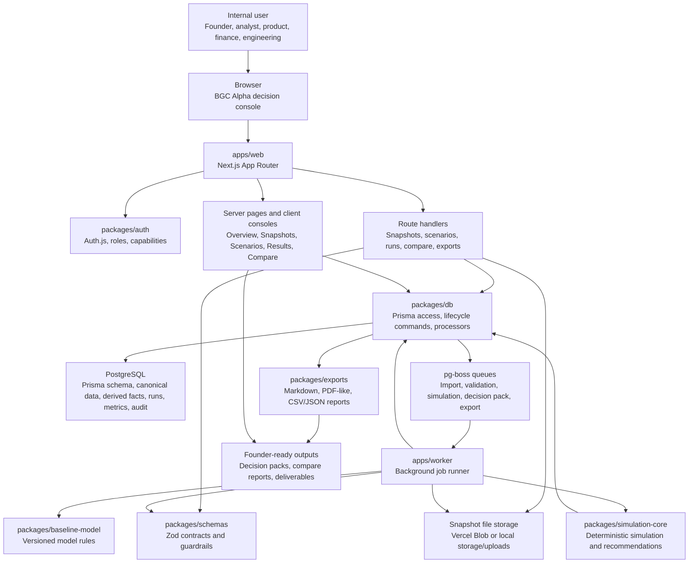

# Architecture

Last updated: 2026-05-15

## Stack

This is a pnpm/Turborepo TypeScript monorepo.

Runtime and framework choices:

- Package manager: `pnpm@9.15.0`
- Orchestration: Turborepo
- Web app: Next.js 15 App Router, React 19, TypeScript
- API layer: Next.js route handlers under `apps/web/app/api`
- Auth: Auth.js / NextAuth beta with credentials-backed seeded users and role capabilities
- Database: PostgreSQL with Prisma
- Worker: Node/TypeScript app using `pg-boss`
- Validation: Zod shared schemas
- Charts: ECharts in the web app
- Exports: internal `@bgc-alpha/exports` package
- Local DB: Docker-managed Postgres on `127.0.0.1:5433`

## Repo Boundaries

Top-level apps:

- `apps/web`: internal Next.js decision console, route handlers, server pages, client consoles, and UI orchestration.
- `apps/worker`: background processor for snapshot validation/import, simulation runs, decision-pack generation, and exports.

Shared packages:

- `packages/auth`: Auth.js wiring, roles, capabilities, password helpers, and guards.
- `packages/db`: Prisma client access, data access functions, import processors, run processor, decision packs, audit, snapshot storage, canonical import/derived data logic.
- `packages/schemas`: Zod contracts for snapshots, scenarios, runs, metrics, canonical data, strategic outputs, and decision packs.
- `packages/simulation-core`: deterministic simulation engine, default metrics, flags, recommendation evaluation, and strategic objective evaluation.
- `packages/baseline-model`: versioned baseline model rules, currently including `model-v1`.
- `packages/exports`: compare and simulation result export renderers.
- `packages/ui`: minimal shared React components such as `Card` and `PageHeader`.
- `packages/config`: shared TypeScript config.

Supporting folders:

- `scripts`: local DB setup, seeding, snapshot import/queue helpers, calibration, data artifact builders, and deck/doc generation scripts.
- `examples`: sample and test-like snapshot inputs.
- `deliverables`: founder/final docs and decks.
- `outputs`: generated mapped data, decks, videos, and intermediate artifacts.
- `storage`: local upload fallback.
- `context`: canonical AI project context pack.

## Architecture Flow Chart

## System Flow

Snapshot flow:

1. Web user creates or uploads a snapshot.
2. Web app stores metadata in `DatasetSnapshot`.
3. Uploads go to Vercel Blob when `BLOB_READ_WRITE_TOKEN` exists; otherwise local dev uses `storage/uploads/snapshots`.
4. User queues import and validation.
5. Worker reads snapshot text through `readSnapshotText`.
6. Import processor detects Full Detail JSON, Full Detail CSV, or Monthly CSV.
7. Full-detail inputs replace canonical snapshot tables and derive monthly facts.
8. Monthly/derived facts are validated in `understanding_doc_strict` mode.
9. Snapshot status, import runs, issues, fingerprints, manifests, and coverage reports are persisted.

Scenario and run flow:

1. User creates/updates scenario against a baseline model and default snapshot.
2. Scenario parameters are parsed by `parseFounderSafeScenarioParameters`.
3. Guardrails reject locked or unsafe parameter changes.
4. Launch creates a `SimulationRun`.
5. Worker processes the run with `processSimulationRun`.
6. DB layer gathers snapshot member-month facts, pool period facts, model rules, scenario params, and coverage/gap audits.
7. `@bgc-alpha/simulation-core` returns summary metrics, time-series, segment metrics, flags, milestone evaluations, and recommendation data.
8. DB persists results and decision-pack payload.
9. Run, distribution, token-flow, treasury, compare, and decision-pack pages read persisted outputs.

## Data Model

Important Prisma groups:

- Identity and auth: `User`, `Role`, `UserRole`, `AuditEvent`.
- Snapshot lifecycle: `DatasetSnapshot`, `SnapshotValidationIssue`, `SnapshotImportRun`, `SnapshotImportIssue`.
- Derived simulation facts: `SnapshotMemberMonthFact`, `SnapshotRewardSourcePeriodFact`, `SnapshotPoolPeriodFact`.
- Full-detail/canonical data: `CanonicalMember`, aliases, role history, offers, business events, PC/SP ledger entries, reward obligations, pool ledger entries, cash-out events, qualification windows, and qualification status history.
- Baseline/scenario/run: `BaselineModelVersion`, `Scenario`, `SimulationRun`.
- Results: `RunSummaryMetric`, `RunTimeSeries`, `RunSegmentMetric`, `RunFlag`, `DecisionPack`, `RunDecisionLogResolution`.

## Data Contracts

Snapshot inputs:

- Monthly CSV (`compatibility_csv`): one member, source system, and month per row.
- Full Detail CSV (`canonical_csv`): one CSV with `record_type` rows representing members, aliases, role history, offers, business events, ledgers, cash-outs, qualification windows, and status history.
- Full Detail JSON (`canonical_json`): nested canonical/full-detail payload.
- Full Detail Bundle (`canonical_bundle`): source-detail bundle concept for prepared multi-file sets.
- Hybrid Data (`hybrid_verified`): mixed detailed and monthly aggregate data during migration.

Scenario contracts:

- User-facing mode labels: `Imported Data Only` and `Add Forecast`.
- Internal mode codes: `founder_safe` and `advanced_forecast`.
- Allowed levers include `k_pc`, `k_sp`, `cap_user_monthly`, and `cap_group_monthly`.
- Conditional levers include sink target/model, cash-out policy, projection horizon, milestone schedule, ALPHA token policy, forecast policy, and Web3 assumptions.
- Locked levers include generic `reward_global_factor`, `reward_pool_factor`, and cohort assumptions in Imported Data Only mode.

## Architectural Invariants

- Do not put heavy simulation work directly in request handlers.
- Do not merge PC, SP, fiat, pool, reward obligations, cash-out, and ALPHA into a generic value bucket.
- Do not make monthly aggregates the only source of business meaning when full-detail data exists.
- Do not change the meaning of BGC/iBLOOMING reward sources to simplify engine code.
- Keep money outputs separate from ALPHA movement.
- Keep actual uploaded internal-use data separate from modeled internal-use assumptions.
- Keep forecast periods and forecast impact visible.
- Use persisted run outputs for compare and exports; compare should not silently create a new scenario.
- Keep audit events around key lifecycle actions.

## Environment And Deployment

Local development:

- Start Docker.
- Run `pnpm dev:setup`.
- Run `pnpm dev`.
- Restart worker after code changes that add or alter job handlers.

Important env vars:

- `DATABASE_URL`
- `AUTH_SECRET`
- `AUTH_TRUST_HOST`
- `SEED_USER_PASSWORD`
- `WORKER_CONCURRENCY`
- `SIMULATION_ENGINE_VERSION`
- `BLOB_READ_WRITE_TOKEN`
- Vercel/Postgres fallbacks: `POSTGRES_PRISMA_URL`, `POSTGRES_URL`, `POSTGRES_URL_NON_POOLING`, and related variables.

Vercel:

- Set root directory to `apps/web`.
- Use hosted Postgres for `DATABASE_URL` or supported Vercel Postgres variables.
- Connect Vercel Blob for browser snapshot uploads.
- Root-level Vercel deploy will fail to detect Next.js because the app lives under `apps/web`.

## Risks

- Many generated and source-data artifacts are untracked; avoid accidental cleanup or overwrite.
- Full-detail data semantics are business-critical and should not be compressed into convenience-only fields.
- Scenario outputs can be misleading if forecast assumptions are not labeled.
- A run with weak source detail coverage should not be used as final evidence without explicit review.
- Some packages have placeholder test scripts; do not assume full automated coverage.
- Auth middleware is currently permissive; route/page-level guards carry most access checks.
